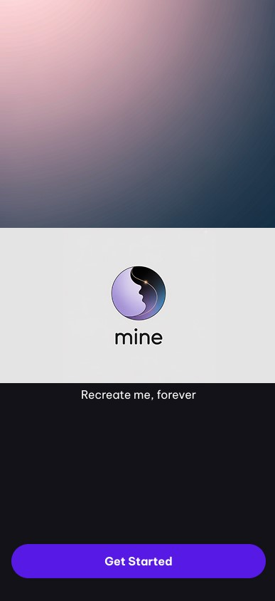
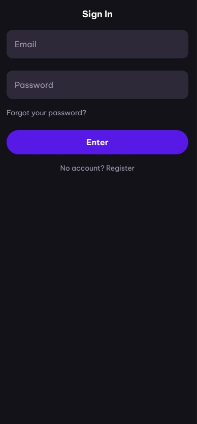
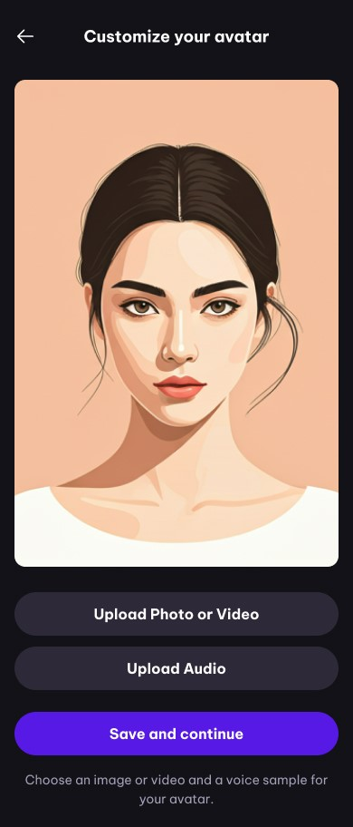
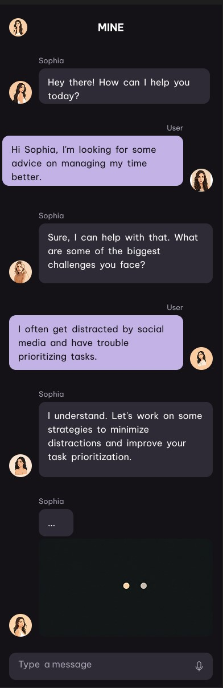
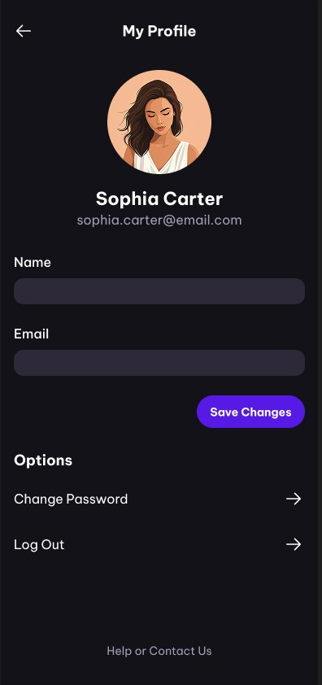

# 🤖 MINE: Chatbot Hiperrealista con Avatar Personalizado

MINE es una aplicación móvil que permite a los usuarios crear un **compañero digital hiperrealista**, basado en su propia imagen, voz y estilo comunicativo. Integra tecnologías avanzadas de inteligencia artificial para ofrecer una experiencia de conversación fluida, personalizada y visualmente inmersiva.

## 🚀 Características principales

- 👤 Avatar visual generado a partir de fotos reales
- 🔊 Voz clonada con entonación natural (ElevenLabs)
- 🧠 Personalidad configurable mediante cuestionario
- 🗣️ Chat en tiempo real con memoria contextual (OpenAI GPT)
- 🎬 Respuestas animadas con video (D-ID/HeyGen)
- ☁️ Sincronización en la nube con Firebase

## 🛠️ Tecnologías Utilizadas

- **Frontend:** Flutter (Dart)
- **Backend:** Node.js (Express)
- **Servicios Cloud:** Firebase (Auth, Firestore, Storage)
- **IA / APIs:**
  - OpenAI GPT (conversación)
  - ElevenLabs (voz)
  - D-ID o HeyGen (avatar animado)

## 🧰 Herramientas necesarias para modificar el proyecto

Para realizar cambios y contribuir al desarrollo de MINE-Chatbot, necesitas instalar y configurar las siguientes herramientas:

- **Git:** Control de versiones y gestión de repositorios.  
  [Descargar Git](https://git-scm.com/downloads)

- **Visual Studio Code:** Editor de código recomendado para editar archivos, depurar y gestionar el proyecto.  
  [Descargar VS Code](https://code.visualstudio.com/)

- **Flutter SDK:** Framework para desarrollar la aplicación móvil.  
  [Instalación Flutter](https://docs.flutter.dev/get-started/install)
  # mobile

A new Flutter project.

## Getting Started

This project is a starting point for a Flutter application.

A few resources to get you started if this is your first Flutter project:

- [Lab: Write your first Flutter app](https://docs.flutter.dev/get-started/codelab)
- [Cookbook: Useful Flutter samples](https://docs.flutter.dev/cookbook)

For help getting started with Flutter development, view the
[online documentation](https://docs.flutter.dev/), which offers tutorials,
samples, guidance on mobile development, and a full API reference.

- **Node.js y npm:** Entorno de ejecución para el backend y gestor de paquetes.  
  [Descargar Node.js](https://nodejs.org/)

- **Firebase CLI:** Herramienta para administrar servicios de Firebase desde la terminal.  
  Instala con:  
  ```
  npm install -g firebase-tools
  ```

- **Acceso a APIs externas:**  
  - OpenAI (GPT): Necesitas una clave de API.
  - ElevenLabs: Necesitas una clave de API.
  - D-ID o HeyGen: Necesitas una clave de API.

**Recomendación:** Consulta la documentación oficial de cada herramienta para detalles de instalación y configuración según tu sistema operativo.

## 📁 Estructura del Proyecto
root/
- backend/        # API Node.js (Express)
    - index.js
    - package.json
    - config/
        - firebase.js
        - index.js
        - serviceAccountKey.json
    - controllers/
        - avatarController.js
        - chatController.js
        - healthController.js
        - userController.js
        - voiceController.js
    - middlewares/
        - errorHandler.js
    - routes/
        - avatar.js
        - chat.js
        - health.js
        - user.js
        - voice.js
    - services/
        - didService.js
        - elevenlabsService.js
        - openaiService.js
    - utils/
        - logger.js
- mobile/         # App Flutter
    - android
    - ios
    - lib
        - screens
            -  chat_screen.dart
            -  crete_avatar_screen.dart
            -  login_screen.dart
            -  profile_screen.dart
            -  splash_screen.dart
        - main.dart
- docs/           # Documentación técnica y de usuario
    - curl test endpoints.txt
    - Plan Paso a Paso.docx
    - Propuesta de Desarrollo.docx
    - Readme_plan.md

## 📅 Plan de Desarrollo (40 días)

Consulta el documento `mine-chat-app/docs/Plan Paso a Paso.pdf` para ver el cronograma completo por días y entregables.

### 📐 Wireframes

A continuación puedes ver los wireframes principales del proyecto, ubicados en la carpeta `docs/`:
- Wireframe Pamtalla Principal

- Wireframe Login

- Wireframe Crear Avatar

- Wireframe Chat

- Wireframe Perfil


## 🧪 Estado del Proyecto

| Día | Actividad                                                                                 | Estado      |
|-----|-------------------------------------------------------------------------------------------|-------------|
| 01  | Instalación de herramientas, Flutter, Git, VSCode, estructura de carpetas y GitHub       | ✅ Completado |
| 02  | Configuración de APIs (OpenAI, ElevenLabs, D-ID/HeyGen), Firebase                        | ✅ Completado |
| 03  | Inicialización de proyecto backend con Express, estructura de carpetas y .env            | ✅ Completado |
| 04  | Conexión de backend con Firebase y servicios IA                                          | ✅ Completado |
| 05  | Diseño de wireframes, inicio de proyecto Flutter y estructura base                       | ✅ Completado |
| 06  | Implementación de pantalla de bienvenida y autenticación con Firebase                    |  |
| 07  | Captura y validación de fotos, subida a Firebase Storage                                 |   |
| 08  | Grabación y reproducción de voz, almacenamiento en Firebase                              |   |
| 09  | Cuestionario de personalidad (UI + backend + Firestore)                                  |   |
| 10  | Endpoints para personalización: fotos, voz y personalidad                                |   |
| 11  | Integración de OpenAI en backend con prompts dinámicos                                   |   |
| 12  | Integración con ElevenLabs para clonación y reproducción de voz                          |   |
| 13  | Creación de avatar animado desde fotos/audio con D-ID / HeyGen                          |   |
| 14  | Almacenamiento y CRUD de perfiles de avatar                                              |   |
| 15  | Pruebas completas del backend y documentación de API                                     |   |
| 16  | Interfaz de resumen de avatar y proceso de generación visual                             |   |
| 17  | Diseño de la pantalla de chat con avatar y campo de entrada                              |   |
| 18  | Lógica de envío/recepción de mensajes y conexión con backend                             |   |
| 19  | Visualización del avatar animado con reproductor de video                               |   |
| 20  | Reproducción de respuestas de voz sincronizadas                                          |   |
| 21  | Persistencia de historial de chat local y en Firestore                                   |   |
| 22  | Animaciones, transiciones y microinteracciones                                           |   |
| 23  | Mejora de prompts para mayor naturalidad conversacional                                  |   |
| 24  | Sistema de memoria conversacional (corto y largo plazo)                                  |   |
| 25  | Feedback visual, sonoro y táctil                                                         |   |
| 26  | Optimización de tiempos de carga (precarga de recursos, caché)                          |   |
| 27  | Mejora de accesibilidad y soporte para gestos                                            |   |
| 28  | Ajustes de personalidad (UI + backend)                                                   |   |
| 29  | Selección de temas de conversación e intereses                                           |   |
| 30  | Personalización visual del avatar y la interfaz                                          |   |
| 31  | Guardado y sincronización de configuraciones entre dispositivos                         |   |
| 32  | Sistema de evolución relacional avatar-usuario                                           |   |
| 33  | Pruebas de usuario con feedback documentado                                              |   |
| 34  | Corrección de usabilidad basada en feedback                                              |   |
| 35  | Optimización de rendimiento general                                                      |   |
| 36  | Reducción de latencia, compresión, reintentos y feedback visual                          |   |
| 37  | Pruebas en dispositivos reales (diversas pantallas y versiones Android)                 |   |
| 38  | Corrección de bugs críticos y pruebas de regresión                                       |   |
| 39  | Implementación de feedback final, textos, estilos y UX                                   |   |
| 40  | Publicación en Google Play Store / App Store + sistema de monitoreo                     |   |


## 🔐 Licencia

Este proyecto está licenciado bajo la **APACHE License**. Consulta el archivo [LICENSE](LICENSE) para más detalles.

## 🙌 Contribuciones

¡Las contribuciones son bienvenidas! Por favor abre un _issue_ o _pull request_ si quieres colaborar o proponer mejoras.

## 📬 Contacto

Proyecto desarrollado por Su Gestión SAS.  

Equipo de trabajo:
Julian Andres Garcia Guerrero
📧 Correo: jagarciaguer@msn.com


